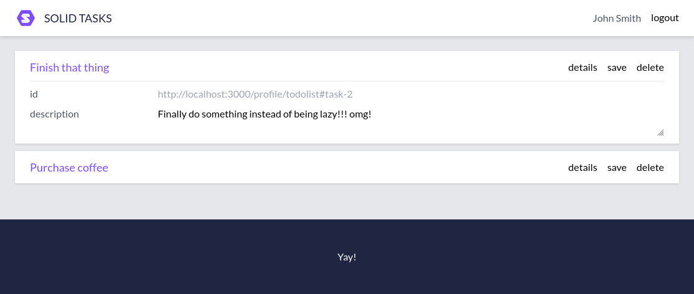

# Solid ToDo Prototype

This is just a small experiment to figure out some details related to implementing a to-do application on top of Solid, and is **not intended for actual use** in any capacity whatsoever. The prototpe is written with [Vue](https://vuejs.org/), and uses [Vite](https://vitejs.dev/) for bundling. The to-do entries are intended to be stored in a Solid pod, and fetched using [Comunica](https://github.com/comunica/comunica-feature-link-traversal).



So far, the prototype does the following:

* Allows logging in and out of a webId provider
  * The user provides their webId, and the provider is discovered via `solid:oidcIssuer` predicate in their webId triples using a SPARQL query
  * The application fetches and displays the user's name from `foaf:name` or `foaf:givenName` after logging in, with a SPARQL query
* Displays to-do entries (using a custom vocabulary) linked in the webId, using a SPARQL query
  * The entries have save and delete buttons on them, but they do not do anything yet

Available scripts:

* Installing dependencies: `npm install`
* Running for development purposes: `npm run dev`
* Running ESLint: `npm run lint`
* Building for production: `npm run build`
* Previewing production build: `npm run preview`

Example to-do entry:
```
@prefix todo: <https://example.org/todo/> .

<> a todo:List ;
  todo:title "Default" ;
  todo:description "This is an example todo list" ;
  todo:author <https://someones-web-id.be/#me> .

<#label-1> a todo:Label ;
  todo:title "Groceries" ;
  todo:description "Related to buying food" ;
  todo:colour "#00FF00" .
  # or "rgb(0, 255, 00)" "green" etc. ?

<#task-1> a todo:Task ;
  todo:title "Purchase coffee" ;
  todo:description "Instant coffee, cheapest possible! Gogogo @<https://someone-elses-web-id.be/#me>!" ;
  # when displaying the description, the link @<https://someone-elses-web-id.be/#me> could be converted
  # into the person's name to be able to mention them in the description?
  todo:label <#label-1> ;
  todo:author <https://someones-web-id.be/#me> ;
  todo:assignee <https://someone-elses-web-id.be/#me> ;
  todo:deadline "2022-08-01" ;
  todo:finished "2022-07-21" .

<#task-2> a todo:Task ;
  todo:title "Finish that thing" ;
  todo:description "Finally do something instead of being lazy!!! omg!" ;
  todo:author <https://someones-web-id.be/#me> ;
  todo:deadline "2022-08-01" .
  # no assignee = assigned to author/owner by default
  # no finished date = not done yet
```

Example linkage to the to-do entry from a webId (location might vary):
```
  rdfs:seeAlso <http://localhost:3000/profile/todolist>.
```
