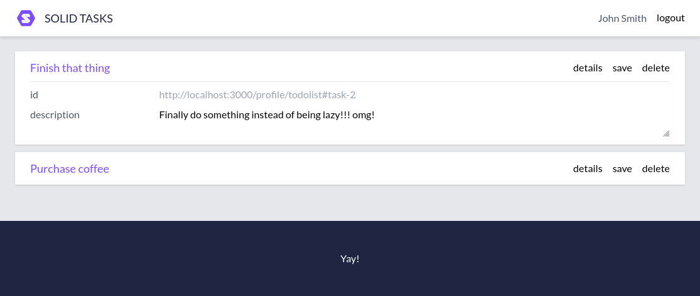

# Solid ToDo Prototype

This is just a small experiment to figure out some details related to implementing a to-do application on top of Solid, and is **not intended for actual use** in any capacity whatsoever. The prototpe is written with [Vue](https://vuejs.org/), and uses [Vite](https://vitejs.dev/) for bundling. The to-do entries are intended to be stored in a Solid pod, and fetched using [Comunica](https://github.com/comunica/comunica-feature-link-traversal).



So far, the prototype does the following:

* Allows logging in and out of a webId provider
  * The user provides their webId, and the provider is discovered via `solid:oidcIssuer` predicate in their webId triples using a SPARQL query
  * The application fetches and displays the user's name from `foaf:name` or `foaf:givenName` after logging in, with a SPARQL query
* Displays to-do entries (using a custom vocabulary) linked in the webId, using a SPARQL query
  * The entries have save and delete buttons on them, but they do not do anything yet

The usual commands are available:

* Installing dependencies: `yarn install`
* Running for development purposes: `yarn run dev`
* Running ESLint: `yarn run lint`
* Building for production: `yarn run build`
* Previewing production build: `yarn run preview`

Example to-do list is available at [data/todolist.ttl](data/todolist.ttl), and can be linked to from a WebID using `rdfs:seeAlso` or any other predicate listed in [the configuration file](https://github.com/comunica/comunica-feature-link-traversal/blob/master/engines/config-query-sparql-link-traversal/config/extract-links/actors/predicates-common.json):
```
  rdfs:seeAlso <http://localhost:3000/profile/todolist>.
```
